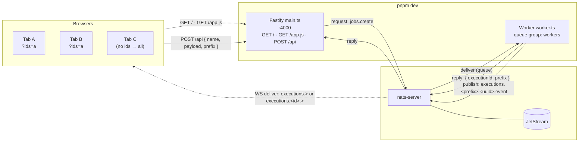

# NATS Node


## Architecture


```mermaid
flowchart LR
    subgraph browsers[Browsers]
        b1["Tab A<br/>?ids=a"]
        b2["Tab B<br/>?ids=a"]
        b3["Tab C<br/>(no ids → all)"]
    end

    subgraph app["pnpm dev"]
        fastify["Fastify main.ts<br/>:4000<br/>GET / · GET /app.js · POST /api"]
        worker["Worker worker.ts<br/>queue group: workers"]
    end

    subgraph natsbox[NATS]
        srv[nats-server]
        js[(JetStream)]
        srv --- js
    end

    %% HTTP: page load + submit
    browsers -.->|"GET / · GET /app.js"| fastify
    browsers -->|"POST /api { name, payload, prefix }"| fastify

    %% Request/reply over NATS
    fastify -->|"request: jobs.create"| srv
    srv -->|"deliver (queue)"| worker
    worker -->|"reply: { executionId, prefix }"| srv
    srv -->|"reply"| fastify

    %% Streamed events over WebSocket
    worker -->|"publish: executions.&lt;prefix&gt;.&lt;uuid&gt;.event"| srv
    srv -.->|"WS deliver: executions.&gt; or executions.&lt;id&gt;.&gt;"| browsers
```

## Run locally

```bash
# 1. Start NATS (docker)
docker compose up -d

# 2. Install deps
pnpm install

# 3. Start API + worker together
pnpm dev
```
