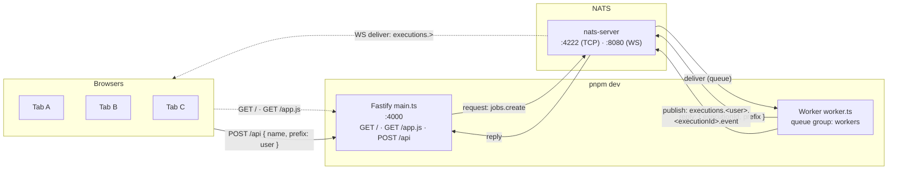

# Live Scoreboard (NATS + Fastify)

A real-time top-10 scoreboard. The browser submits a score for a user over HTTP, Fastify forwards it to a worker via NATS request/reply, and the worker publishes a `succeeded` event that every connected browser receives over a NATS WebSocket subscription. Each tab applies an optimistic local update on its own clicks and treats incoming events as authoritative for other users.

## Architecture



Why optimistic on the clicker: the round-trip is HTTP → NATS req/reply → NATS publish → WS push. The clicker's tab bumps its local copy immediately, then suppresses the eventual NATS event for its own click via a pending-click counter so the score isn't counted twice. Other tabs see the same event and bump normally.

## Run locally

```bash
# 1. Start NATS (docker) — exposes 4222 (TCP) and 8080 (WS)
docker compose up -d

# 2. Install deps
pnpm install

# 3. Start API + worker together
pnpm dev

# 4. Open http://localhost:4000
```

## Integrate with the scoreboard

You don't need this UI to participate — anything that can do HTTP or talk NATS can play.

### Submit a score (HTTP)

```bash
curl -X POST http://localhost:4000/api \
  -H 'content-type: application/json' \
  -d '{ "name": "score", "prefix": "alice" }'

# → { "executionId": "0193...", "prefix": "alice" }
```

Body fields:

| Field    | Type   | Description                                                               |
| -------- | ------ | ------------------------------------------------------------------------- |
| `prefix` | string | The user identifier whose score should be incremented. Required to score. |
| `name`   | string | A free-form job name; logged by the worker. Not interpreted.              |

The response is returned synchronously from the worker via NATS request/reply (3-second timeout). A success means the worker accepted the job and will publish a `succeeded` event.

### Listen for score events (NATS)

Events are published once per submission, on the subject:

```
executions.<prefix>.<executionId>.event
```

Subscribe to `executions.>` to receive every score in the system, or `executions.alice.>` to follow a single user.

Event payload (`ExecutionEvent`, see `types.ts`):

```ts
{
  executionId: string; // UUIDv7, unique per submission
  prefix: string; // user identifier
  status: "succeeded"; // only status emitted today
  at: string; // ISO timestamp
}
```

### Connect from a server (Node / Go / etc.)

Any [official NATS client](https://docs.nats.io/using-nats/developer) can subscribe to `executions.>` over the TCP port (`:4222`) or publish a `jobs.create` request directly without going through Fastify:

```ts
import { connect, StringCodec } from "nats";
const nc = await connect({ servers: "nats://localhost:4222" });
const sc = StringCodec();

const msg = await nc.request(
  "jobs.create",
  sc.encode(JSON.stringify({ name: "score", prefix: "alice" })),
  { timeout: 3000 },
);
console.log(JSON.parse(sc.decode(msg.data))); // { executionId, prefix }
```
